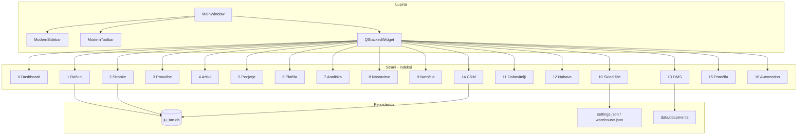

# Arhitektura — JU-TAN Office Enterprise

Aplikacija je **lokalna namizna** PySide6 rešitev. Ni HTTP API strežnika.

## Sklad

| Plast | Lokacija | Vloga |
| --- | --- | --- |
| Vstop | `app.py` | Log, inicializacija SQLite, `run()` |
| Okno | `app/windows/main_window.py` | Sidebar, toolbar, `QStackedWidget` (fiksni indeksi 0–15) |
| Moduli | `app/modules/*` | Strani, dialogi, controllerji, storitve |
| Widgeti | `app/widgets/*` | Tabele (`EnterpriseTable`), KPI, navigacija |
| Podatki | `app/database/*` | SQLite + repository |
| Dokumenti | `app/pdf/*`, `app/excel/*` | Izvoz PDF/XLSX |
| Jedro | `app/core/*` | Konstante, log, napake, cache, lazy strani, varnost |
| Tema | `app/theme/` | QSS + `ThemeManager` (brez lokalnih stylesheetov) |

## Diagram modulov

## Performanse

- Strani 1–15 so `LazyPage` (tovarna ob prvem obisku; indeksi ostanejo).
- Poročila: `QTimer` + `QThread` + paginacija 50 vrstic.
- SQLite: WAL, `busy_timeout`, parametri `?`.
- `ttl_cache` na `ReportingService.filter_options`.

## Varnost

- Parametrizirani SQL, whitelist identifikatorjev v `BaseRepository`.
- Atomski zapis nastavitev, obnovitev poškodovanega JSON.
- Dovoljenja: lokalni enouporabniški model + audit log.
- Poti: `ensure_inside`, `safe_filename`.
